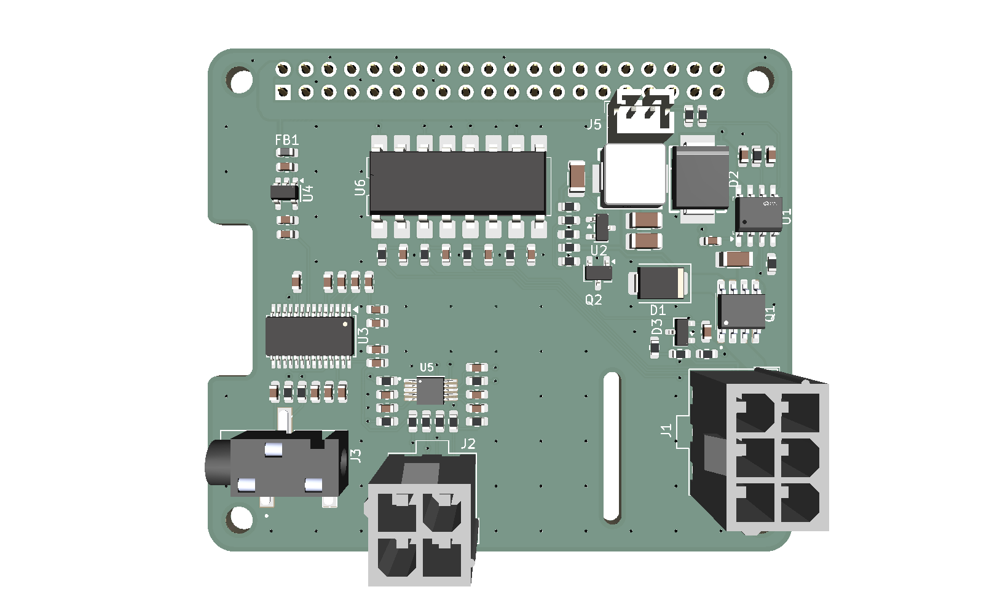

# PiGarage

Open-source Raspberry Pi power management and audio HAT for automotive head-unit use.



## Features

- **5V 5A Buck Converter** (TPS54560BQDDARQ1) — 7-16V input, Pi 5 compatible
- **I2S DAC** (PCM5122PWR) — 112dB SNR, noise-free audio output to external amplifier
- **ADC** (ADS1115) — 16-bit, for steering wheel resistor ladder controls
- **4-Channel Optoisolated 12V Sensing** — ACC, REV, ILL, AUX via LTV-847S
- **Safe Shutdown** — ACC-triggered power latch with GPIO hold (BCM25), crank ride-through
- **Battery Protection** — UVLO hard cutoff at 12.08V via TL431A comparator
- **Fan Output** — JST SH 1.0mm 2-pin connector (Pi 5 fan style) for 25mm buck cooler fan
- **Compatible** — Raspberry Pi 3, 4, and 5

## Board

| Parameter | Value |
|-----------|-------|
| Input Voltage | 7-16V (automotive 12V) |
| Output Voltage | 5.0V |
| Output Current | 5A continuous |
| DAC SNR | 112dB |
| DAC Interface | I2S |
| ADC Resolution | 16-bit, 4-channel |
| Sense Inputs | 4ch optoisolated |
| Board Format | Raspberry Pi HAT (65mm x 56.5mm) |

## Directory Layout

```
PiGarage/
├── Hardware/           KiCad 10 schematic, PCB, and custom libraries
├── Production/         Gerbers, drill files, pick-and-place
├── BOM/                Bill of Materials and design notes
├── Images/             Board renders and schematic exports
├── Software/           Power latch daemon and systemd service
└── Docs/               Ordering and assembly guide
```

## Getting Started

See [Docs/ordering-guide.md](Docs/ordering-guide.md) for full instructions on ordering from JLCPCB and assembling the board.

## License

Hardware: [CERN-OHL-S-2.0](https://ohwr.org/cern_ohl_s_v2.txt) — Software: MIT
